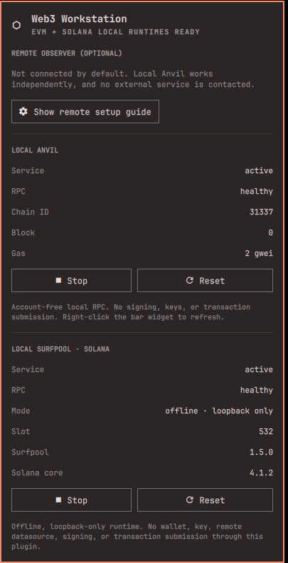
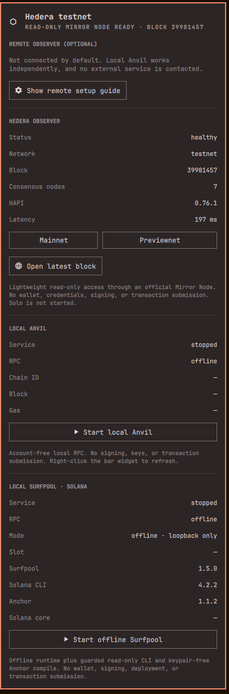

<div align="center">

# ⛓ Web3 Workstation

<sub>by LimeChain</sub>

### Chain engineering for Omarchy Quattro

**Build, test, fuzz, run, and inspect EVM, Solana, and Hedera from one reproducible workstation.**<br>
Not another price ticker. Not a wallet. Not a signing surface.

[](https://github.com/LimeChain/omarchy-web3/actions/workflows/ci.yml)


[](LICENSE)

<br>



<sub>Native Quattro panel · Anvil + offline Surfpool healthy · no wallet or key access</sub>

</div>

## A workstation, not a widget

| Build | Break | Run | Inspect |
|:--|:--|:--|:--|
| Foundry, Anchor, Solidity, Rust, Node.js, Bun | Slither, Echidna, Forge fuzzing | Account-free Anvil + offline Surfpool | EVM blocks/fees + Solana health + Hedera Mirror Node |

Everything is additive and user-scoped. Tool versions and checksums are pinned, the sample contract runs locally, and the Quattro plugin delegates to a deliberately narrow CLI surface.

> [!IMPORTANT]
> The workstation never handles seed phrases, private keys, signing, transaction submission, exchange automation, or automatic mainnet deployment.

## Install

> [!WARNING]
> **Manual setup is required.** Marketplace installation adds the reviewed plugin checkout only. Review this scope, then run the profile installer yourself; it never asks for `sudo`.

Install through Quattro's native plugin flow, then explicitly install the first profile:

```bash
omarchy plugin add https://github.com/LimeChain/omarchy-web3.git --enable --yes && ~/.config/omarchy/plugins/limechain.web3/install --profile evm-core
```

One command. No fork. User-scoped installation. No system package changes. No blind AUR bundle.

The profile installer owns only these paths and refuses pre-existing unmarked collisions:

| Scope | Path / change | Uninstall |
|:--|:--|:--|
| Application | `~/.local/share/limechain-web3` | Removed |
| Command | `~/.local/bin/limechain-web3` symlink | Removed |
| Configuration | `~/.config/limechain-web3/config.json` (`0600`) | Preserved; removed by `--purge` |
| State | `~/.local/state/limechain-web3` | Removed |
| Verified cache | `~/.cache/limechain-web3` | Preserved; removed by `--purge` |
| Local services | Two marked files under `~/.config/systemd/user` | Removed |
| Omarchy menu | One bounded `limechain.web3` managed block | Removed |
| Plugin checkout | `~/.config/omarchy/plugins/limechain.web3` is managed by Omarchy | Removed through Omarchy |

Every mutable application change is staged before commit. If validation, service reload, or shell reload fails, the installer restores the prior app, state, units, command link, and menu. Download cache entries may remain, but are byte-bounded and accepted only when their locked size and SHA-256 match.

> [!NOTE]
> Security ownership markers begin with `0.3.0`. An experimental `0.1.x`/`0.2.x` workstation is intentionally not auto-adopted. Before upgrading that pre-marketplace build, use its installed `limechain-web3 uninstall --purge`, update the Omarchy plugin, then perform a clean `0.3.0` profile install.

Add the production-ready Solana profile with the same installer:

```bash
~/.config/omarchy/plugins/limechain.web3/install --profile solana-core
```

It installs pinned Solana CLI, Anchor, SBF platform tools, and Surfpool artifacts. The public surface is deliberately smaller than the upstream tools: read-only CLI queries target local Surfpool, while Anchor can only scaffold and compile a keypair-free workspace.

Add the lightweight Hedera profile—no Kubernetes, containers, binary downloads, or local validator:

```bash
~/.config/omarchy/plugins/limechain.web3/install --profile hedera-core
```

It connects read-only to Hedera's official public Mirror Node API, defaults to Testnet, and opens explorer links in HashScan. It never starts Solo or creates funded accounts.

## Your first five minutes

```bash
# Verify the complete workstation
limechain-web3 doctor

# Create and test a local project
limechain-web3 scaffold ~/Code/limechain-counter
cd ~/Code/limechain-counter
limechain-web3 exec forge build
limechain-web3 exec forge test
```

Try the guarded Solana developer path:

```bash
limechain-web3 surfpool start
limechain-web3 solana slot
limechain-web3 anchor scaffold ~/Code/limechain-anchor-counter
limechain-web3 anchor build ~/Code/limechain-anchor-counter
```

Inspect Hedera without a wallet or local cluster:

```bash
limechain-web3 hedera status
limechain-web3 hedera latest-block
limechain-web3 hedera nodes
limechain-web3 hedera account 0.0.3 --json
limechain-web3 hedera network mainnet
```

<p align="center">
  <br>
  <sub>Live Hedera Testnet observer · official Mirror Node · no Solo, Kubernetes, wallet, or signing</sub>
</p>

The first Anchor build downloads only Cargo dependencies pinned by the sample's `Cargo.lock`. Re-run it with `--offline` to prove the cached build path.

<a href="docs/assets/quattro-forge-test.png">
  
</a>

<p align="center"><sub>Real host validation · unit and fuzz tests passing inside the pinned environment</sub></p>

Use `limechain-web3 exec …` for individual commands or enter the complete environment with:

```bash
limechain-web3 shell
```

The installer does not replace an existing global Foundry, Node.js, Bun, Python, or Solidity setup.

### Optional coding-agent skill

The marketplace/profile installer **does not install behavioral instructions** into any coding agent. If you want the separately reviewed helper skill, opt in explicitly from the plugin checkout:

```bash
~/.config/omarchy/plugins/limechain.web3/install-agent-skill
```

It has a fixed destination, `~/.agents/skills/limechain-web3`, and refuses symlink components, foreign ownership, unmarked collisions, extra files, or local modifications. Remove it **before removing the plugin checkout**:

```bash
~/.config/omarchy/plugins/limechain.web3/uninstall-agent-skill
```

## One panel, four independent modes

| | Local Anvil | Local Surfpool | EVM observer | Hedera observer |
|:--|:--|:--|:--|:--|
| Purpose | EVM development RPC | Offline Solana development RPC | Read-only public EVM telemetry | Read-only Hedera inspection |
| Default | With `evm-core` | With `solana-core` | Unconfigured by design | Testnet with `hedera-core` |
| Network | `127.0.0.1:8545` | `127.0.0.1:8899` | User-selected HTTPS endpoint | Official Mirror Node API |
| Actions | Start, Stop, Reset | Start, Stop, Reset | Block, gas, fee, health, explorer | Block, nodes, account/transaction lookup, HashScan |
| Credentials | None | No wallet/key access | Credential-free URLs only | None; fixed public endpoints |

A fresh local chain starts at block 0. **Reset** returns it to a clean block-0 state. Starting Anvil does not configure or contact a remote service.

To add optional Sepolia telemetry:

```bash
limechain-web3 configure \
  --name Sepolia \
  --chain-id 11155111 \
  --rpc-url https://YOUR-CREDENTIAL-FREE-PUBLIC-RPC \
  --explorer-url https://sepolia.etherscan.io
```

URLs containing usernames, passwords, query parameters, or fragments are rejected. The panel's **Show remote setup guide** action opens the same safe instructions in a normal terminal.

## What ships

- **Verified EVM core:** `forge`, `cast`, `anvil`, `chisel`, Solidity, `solc-select`, Node.js LTS, Bun, Slither, Echidna, and `uv`.
- **Native Omarchy integration:** Quattro bar widget, plugin panel, and bounded Omarchy menu entries. A coding-agent skill is available only as a separate explicit opt-in.
- **Managed local chain:** a loopback-only, silent `systemd --user` Anvil service with zero accounts.
- **Verified Solana core:** Agave CLI `4.2.2`, Anchor `1.1.2`, its compatible SBF platform-tools `1.52`, and Surfpool `1.5.0`, all from versioned upstream release artifacts with locked SHA-256 digests.
- **Narrow Solana workflow:** local read-only CLI queries and keypair-free Anchor scaffolding/compilation; wallet, keygen, config, airdrop, test/deploy, and transaction commands stay blocked.
- **Lightweight Hedera core:** fixed official Mirror Node endpoints, block and node health, curated account/transaction inspection, and HashScan deep links—with no Solo, Kubernetes, Docker, downloaded binary, funded account, or signing surface.
- **Ready-to-run sample:** dependency-free Solidity unit tests, fuzz tests, Slither analysis, and an Echidna property.
- **Supply-chain evidence:** version lockfiles, SHA-256 verification, SPDX SBOM, release checksums, and GitHub provenance.

## Roadmap

<div align="center">

### Three ecosystems ready. More networks are coming.

<table>
  <tr>
    <th colspan="3">READY NOW</th>
  </tr>
  <tr>
    <td align="center">
      <br>
      <sub>Foundry · Anvil · Slither · Echidna</sub>
    </td>
    <td align="center">
      <br>
      <sub>Solana CLI · Anchor · Surfpool</sub>
    </td>
    <td align="center">
      <br>
      <sub>Mirror Node · HashScan · no local cluster</sub>
    </td>
  </tr>
  <tr>
    <th colspan="3">NEXT ON THE ROADMAP</th>
  </tr>
  <tr>
    <td align="center">
      <br>
      <sub>Local development and read-only inspection</sub>
    </td>
    <td align="center">
      <br>
      <sub>Optional local lab after upstream small-hardware support ships</sub>
    </td>
    <td align="center">
      <br>
      <sub>The same reproducible, non-custodial profile model</sub>
    </td>
  </tr>
</table>

<br>

<strong>ONE LIMECHAIN-READY STANDARD</strong><br>
<sub>Reproducible installation · Safe updates · Clean uninstallation · Hardened security · Clean-ISO validation</sub><br><br>
<sub>Bitcoin is next—not last. A separate optional Solo lab follows only after an upstream release supports small hardware without weakening the workstation boundary.</sub>

</div>

## Security is the feature

```text
Quattro panel ──fixed commands──▶ limechain-web3 CLI ──allowlist──▶ local tools / read-only RPC + REST
      ✕ keys       ✕ signing          ✕ broadcast          ✕ mainnet deploy
```

Guarded wrappers reject signing, broadcast, credential-bearing RPC URLs, and deployment commands. Quickshell plugins remain unsandboxed user code, so the plugin stays small and all behavior crosses a fixed CLI boundary.

Read the threat model before extending that boundary:

- [Security policy](docs/SECURITY.md)
- [Threat model](docs/THREAT_MODEL.md)
- [Reproducibility](docs/REPRODUCIBILITY.md)
- [Solana artifact and key-handling review](docs/SOLANA_SECURITY_REVIEW.md)
- [Hedera lightweight profile review](docs/HEDERA_SECURITY_REVIEW.md)
- [Wallet compatibility](docs/WALLET_COMPATIBILITY.md)
- [Live Quattro validation](docs/VALIDATION_REPORT.md)

## Lifecycle

```bash
limechain-web3 update
limechain-web3 uninstall
limechain-web3 uninstall --purge
```

Normal uninstall preserves credential-free configuration and the verified download cache. `--purge` removes both. Rollback behavior is documented in [ROLLBACK.md](docs/ROLLBACK.md).

If you opted into the separate coding-agent skill, remove it first with `uninstall-agent-skill`; the workstation uninstaller deliberately never touches cross-tool behavioral instructions.

## License

MIT. Third-party tools retain their upstream licenses and are recorded as separate packages in the SPDX SBOM.
