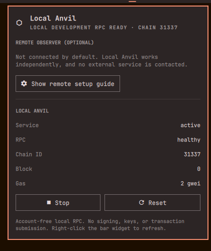
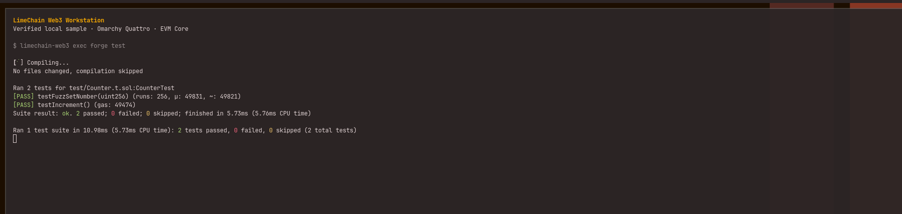

<div align="center">

# ⛓ LimeChain Web3 Workstation

### Chain engineering for Omarchy Quattro

**Build, test, fuzz, run, and inspect EVM chains from one reproducible workstation.**<br>
Not another price ticker. Not a wallet. Not a signing surface.

[](https://github.com/LimeChain/omarchy-web3/actions/workflows/ci.yml)


[](LICENSE)

<br>



<sub>Native Quattro panel · local Anvil healthy · chain 31337 · zero bundled accounts</sub>

</div>

## A workstation, not a widget

| Build | Break | Run | Inspect |
|:--|:--|:--|:--|
| Foundry, Solidity, Node.js, Bun | Slither, Echidna, Forge fuzzing | Account-free Anvil on loopback | Blocks, gas, fees, RPC health, explorer links |

Everything is additive and user-scoped. Tool versions and checksums are pinned, the sample contract runs locally, and the Quattro plugin delegates to a deliberately narrow CLI surface.

> [!IMPORTANT]
> The workstation never handles seed phrases, private keys, signing, transaction submission, exchange automation, or automatic mainnet deployment.

## Install

Review the repository, then install it through Quattro's native plugin flow:

```bash
omarchy plugin add https://github.com/LimeChain/omarchy-web3.git --enable --yes && ~/.config/omarchy/plugins/limechain.web3/install --profile evm-core
```

One command. No fork. No unpinned `curl | bash`. No `sudo`. No blind `yay` bundle.

## Your first five minutes

```bash
# Verify the complete workstation
limechain-web3 doctor

# Create and test a local project
limechain-web3 scaffold ~/Code/limechain-counter
cd ~/Code/limechain-counter
limechain-web3 exec forge build
limechain-web3 exec forge test
```

<a href="docs/assets/quattro-forge-test.png">
  
</a>

<p align="center"><sub>Real host validation · unit and fuzz tests passing inside the pinned environment</sub></p>

Use `limechain-web3 exec …` for individual commands or enter the complete environment with:

```bash
limechain-web3 shell
```

The installer does not replace an existing global Foundry, Node.js, Bun, Python, or Solidity setup.

## One panel, two independent modes

| | Local Anvil | Remote observer |
|:--|:--|:--|
| Purpose | Local development RPC | Read-only public chain/testnet telemetry |
| Default | Available immediately | Unconfigured by design |
| Network | `http://127.0.0.1:8545` | User-selected HTTPS endpoint |
| Chain | `31337` | Must match the configured chain ID |
| Actions | Start, Stop, Reset | Block, gas, fee, health, explorer |
| Credentials | None | Credential-free URLs only |

A fresh local chain starts at block 0. **Reset** returns it to a clean block-0 state. Starting Anvil does not configure or contact a remote service.

To add optional Sepolia telemetry:

```bash
limechain-web3 configure \
  --name Sepolia \
  --chain-id 11155111 \
  --rpc-url https://YOUR-CREDENTIAL-FREE-PUBLIC-RPC \
  --explorer-url https://sepolia.etherscan.io
```

URLs containing usernames, passwords, query parameters, or fragments are rejected. The panel's **Show remote setup guide** action opens the same safe instructions in a normal terminal.

## What ships

- **Verified EVM core:** `forge`, `cast`, `anvil`, `chisel`, Solidity, `solc-select`, Node.js LTS, Bun, Slither, Echidna, and `uv`.
- **Native Omarchy integration:** Quattro bar widget, plugin panel, Omarchy menu entries, and a cross-agent skill at `~/.agents/skills/limechain-web3`.
- **Managed local chain:** a loopback-only, silent `systemd --user` Anvil service with zero accounts.
- **Ready-to-run sample:** dependency-free Solidity unit tests, fuzz tests, Slither analysis, and an Echidna property.
- **Supply-chain evidence:** version lockfiles, SHA-256 verification, SPDX SBOM, release checksums, and GitHub provenance.

## Security is the feature

```text
Quattro panel ──fixed commands──▶ limechain-web3 CLI ──allowlist──▶ local tools / read-only RPC
      ✕ keys       ✕ signing          ✕ broadcast          ✕ mainnet deploy
```

Guarded wrappers reject signing, broadcast, credential-bearing RPC URLs, and deployment commands. Quickshell plugins remain unsandboxed user code, so the plugin stays small and all behavior crosses a fixed CLI boundary.

Read the threat model before extending that boundary:

- [Security policy](docs/SECURITY.md)
- [Threat model](docs/THREAT_MODEL.md)
- [Reproducibility](docs/REPRODUCIBILITY.md)
- [Wallet compatibility](docs/WALLET_COMPATIBILITY.md)
- [Live Quattro validation](docs/VALIDATION_REPORT.md)

## Lifecycle

```bash
limechain-web3 update
limechain-web3 uninstall
limechain-web3 uninstall --purge
```

Normal uninstall preserves credential-free configuration and the verified download cache. `--purge` removes both. Rollback behavior is documented in [ROLLBACK.md](docs/ROLLBACK.md).

## MVP scope

`evm-core` is the ten-day MVP. Bitcoin and Solana profiles are intentionally deferred until the EVM install, update, uninstall, security, and clean-ISO validation paths are release-grade.

## License

MIT. Third-party tools retain their upstream licenses and are recorded as separate packages in the SPDX SBOM.
